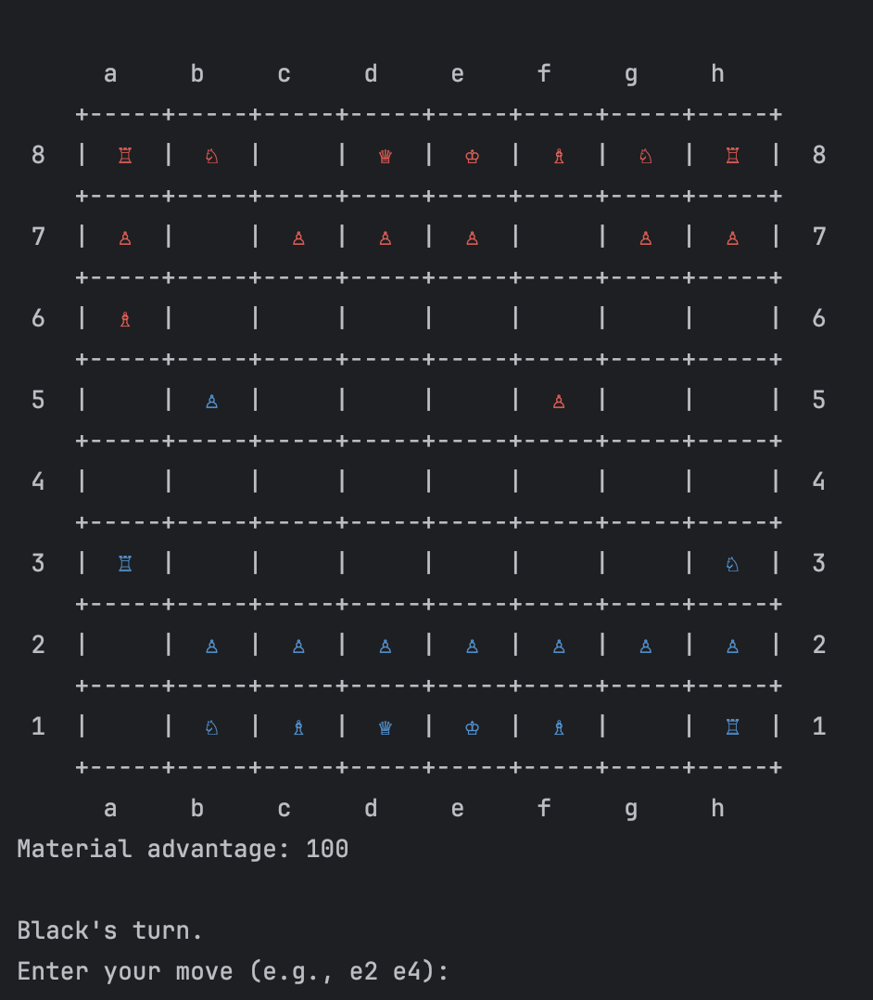
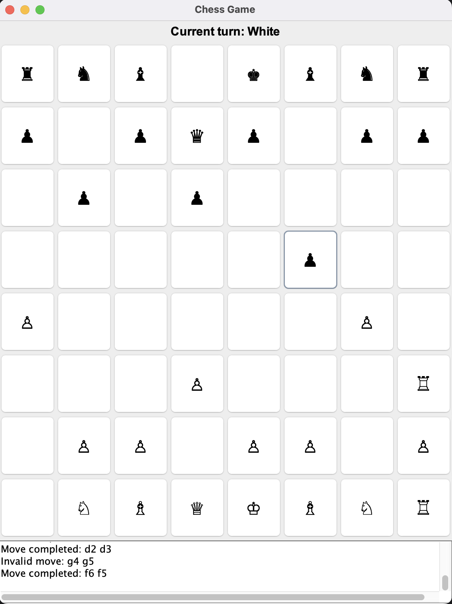

# ♟️ Java Chess Game

A full-featured chess game developed in Java, supporting both a **command-line interface (CLI)** and a **graphical user interface (GUI)** using **Swing**. The game includes classic gameplay, challenge scenarios, and proper move validation according to official chess rules.

---

## ✨ Features

- ✅ Complete chess logic with piece movement and capture
- ✅ Legal move validation with check, checkmate, and stalemate detection
- ✅ Two ways to play:
  - Command-line interface (CLI)
  - Graphical user interface (GUI) with Swing
- ✅ Training challenges with custom board setups
- ✅ Unicode chess piece symbols
- ✅ Clean object-oriented architecture

---

## 🚀 How to Run

### 🧱 Prerequisites
- Java JDK 8 or later
- A terminal or IDE (like IntelliJ IDEA)

### 🖥 Terminal Mode (CLI)

```bash
# Navigate into the src directory
cd src

# Compile the code
javac chess/*.java chess/gameUtils/*.java chess/pieces/*.java

# Run the terminal interface
java chess.Main
```

### 🎨 GUI Mode (Swing)

```bash
# Navigate into the src directory
cd src

# Compile the code including GUI classes
javac chess/*.java chess/gameUtils/*.java chess/pieces/*.java chess/GUI/*.java

# Run the GUI
java chess.GUI.ChessGUI
```

---

## 📸 Preview

  
  
*Gameplay directly from terminal and GUI!*

## 🧩 Project Structure

```
chess/
├── Main.java                 # CLI entry point
├── MainMenu.java            # Menu for CLI
├── Game.java                # Game logic and flow
├── Board.java               # Board state and interaction
├── ChallengeManager.java    # Predefined board challenges
├── GUI/
│   └── ChessGUI.java        # Graphical interface using Swing
├── gameUtils/
│   └── MoveValidator.java   # Validates moves and checks for check/checkmate
└── pieces/
    ├── Rook.java
    ├── Knight.java
    ├── Bishop.java
    ├── Queen.java
    ├── King.java
    ├── Piece.java
    └── Pawn.java
```

---

## ⚙️ Technologies

- Java 8+
- Java Swing (for GUI)
- Plain Java (no external dependencies)

---

## 📜 License

This project is licensed under the [MIT License](LICENSE).

---

## 🙌 Author

Developed by Ricardo Santos.  
Feel free to use, modify, and contribute!
